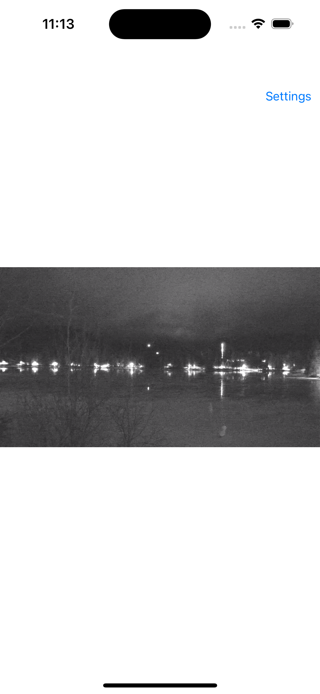
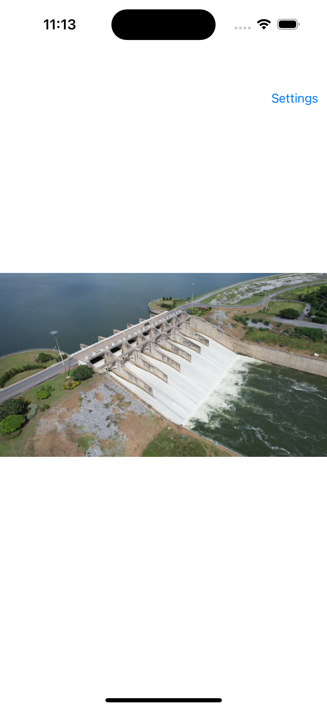
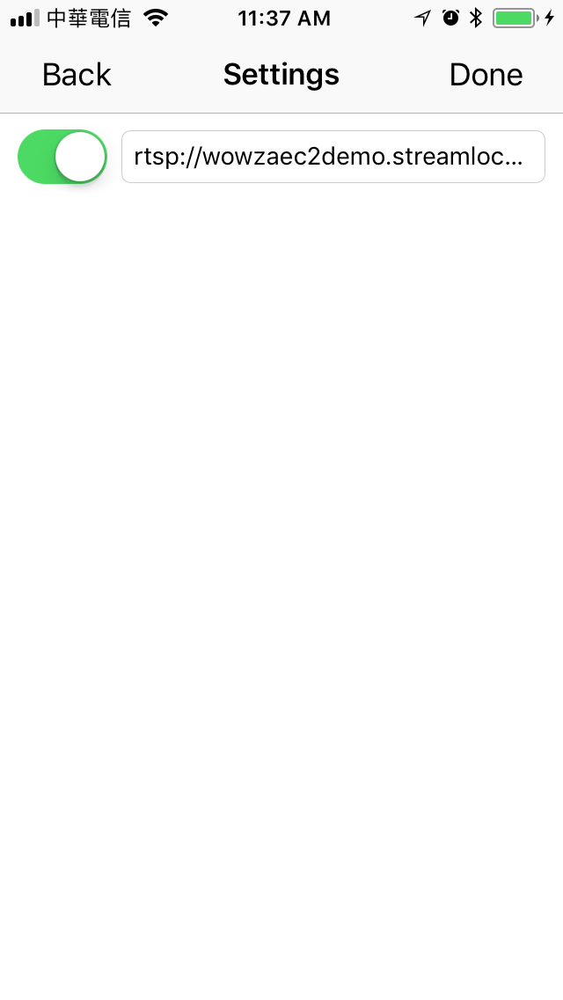

# IRIPCamera

- IRIPCamera is a powerful URL/Rtsp/IPCam player/viewer for iOS.

## How it works?
- Basically, it works by `IRPlayer-swift` + iOS Native API.
    - [IRPlayer-swift](https://github.com/irons163/IRPlayer-swift)
- Decoding the frames by iOS VideoToolbox. The pixel format is NV12.
- `IRPlayer-swift` is the video player which can receive the frames and play it.
    - using `ffmpeg` to deal with RTSP streaming.
- Playing the audio by iOS AudioToolbox.

## Features
- Support RTSP streaming.
- Support for customize connection to your streaming device or IPCam.
- Provide a demo that using `H264-RTSP-Server-iOS` as a RTSP IPCamera and `IRIPCamera-swift` as a RTSP Player.
    - See [H264-RTSP-Server-iOS](https://github.com/irons163/H264-RTSP-Server-iOS).

## How the demo works?
1. Just simply type `demo` or `demo2` or `demo3` in the `Setting` page, then press `Done` button, it will convert to a rtsp url afterward. There are some default public rtps streamings can look at.
2. Prepare 2 iPhones, connecting them in the same network.
    - Run [H264-RTSP-Server-iOS](https://github.com/irons163/H264-RTSP-Server-iOS) in an iPhone, it would show the local IP in the top of the screen.
    - Run this project in the other iPhone, type the RTSP Url into the setting page.
    - Enjoy your personal iPhoneCam : )

## Future
- Support Multi viewer.
- More powerful custom settings.

## Usage

### Basic
- Goto `Setting` Page, then type the URL in the textfield.
    - EX: `rtsp://192.168.2.218`
- OR, you can simply just type `demo`/`demo2`/`demo3` in the textfiled, if you want to use the demo rtsp url.
- Pressing `Done` button, then the program will try to connect and play it.

### Advanced
- Support `fisheye` camera, you need tune it a bit to make it works.
- There are already some codes for custome network connection like IP Cam in this project.
See how the `IRCustomStreamConnector` + `IRCustomStreamConnectionRequest` + `IRStreamConnectionResponse` + `DeviceClass` work.
- The codes for how you connect to your IP Cam are not implement(Login, Query, etc...). You need to customize it.

## Screenshots
|Screenshot|Screenshot|
|---|---|
|||
|||
