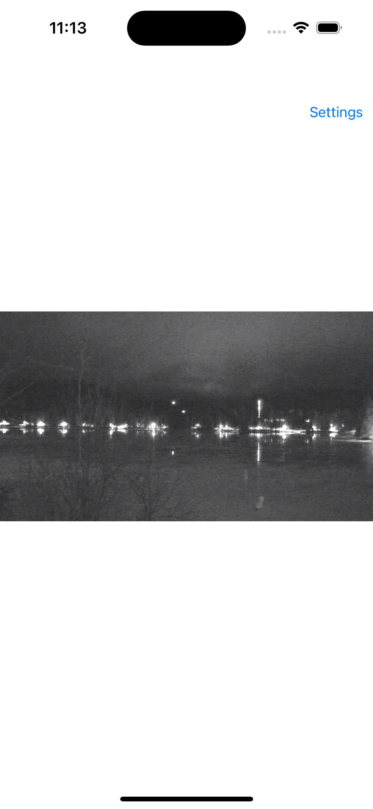
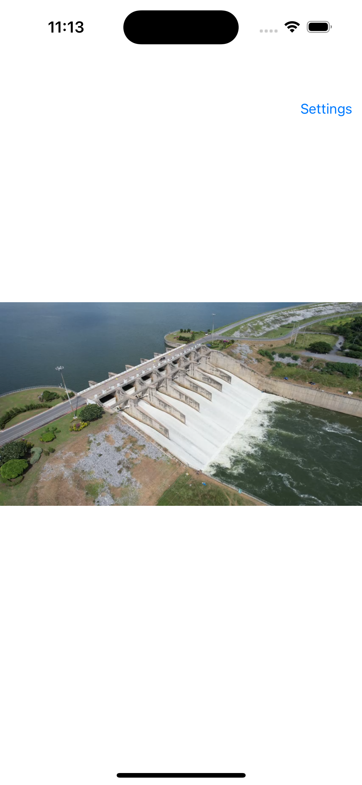
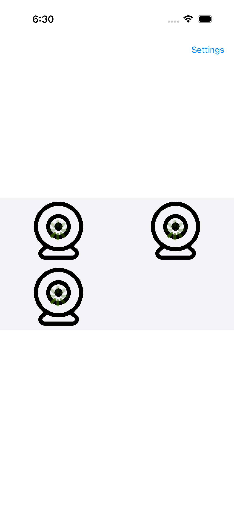
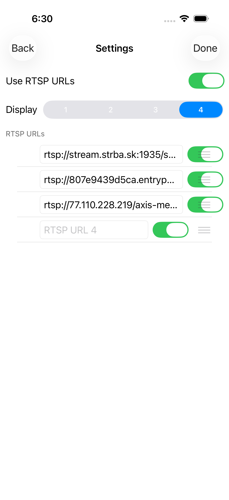

# IRIPCamera

- IRIPCamera is a powerful URL/RTSP/IPCam player/viewer for iOS.

## How it works?
- Basically, it works by `IRPlayer-swift` + iOS Native API.
    - [IRPlayer-swift](https://github.com/irons163/IRPlayer-swift)
- `ffmpeg` (inside `IRPlayer-swift`) handles the RTSP streaming/demuxing.
- Frames are decoded with iOS `VideoToolbox` (hardware), supporting both **H.264/AVC** and **H.265/HEVC**.
    - Handles both Annex B and length-prefixed (AVCC/HVCC) bitstreams, parsing the SPS/PPS/VPS parameter sets.
    - The decoded pixel format is NV12.
- `IRPlayer-swift` receives the decoded frames and renders them.
- Audio is played via iOS `AudioToolbox`.

## Features
- Play RTSP streams (H.264 and H.265/HEVC).
- **Multi-view**: watch 1, 2, or 4 streams at once in a selectable grid layout.
- Configure **up to 4 RTSP URLs**, each independently enabled and reorderable by drag.
- `fisheye` camera support with multiple render modes (panorama, 3D fisheye, 4-split).
- Customizable connection for your own streaming device or IP camera.
- Provides a demo that uses `H264-RTSP-Server-iOS` as an RTSP IPCamera and `IRIPCamera-swift` as the RTSP player.
    - See [H264-RTSP-Server-iOS](https://github.com/irons163/H264-RTSP-Server-iOS).

## How the demo works?
1. In the `Settings` page, type `demo`, `demo2`, or `demo3` into a URL field and press `Done`; each is converted to a public RTSP stream you can watch right away.
2. Or prepare 2 iPhones on the same network:
    - Run [H264-RTSP-Server-iOS](https://github.com/irons163/H264-RTSP-Server-iOS) on one iPhone — it shows its local IP at the top of the screen.
    - Run this project on the other iPhone and type that RTSP URL into the Settings page.
    - Enjoy your personal iPhoneCam : )

## Usage

### Basic
- Open the `Settings` page.
- Toggle the RTSP switch on, then fill in one or more URL fields.
    - EX: `rtsp://192.168.2.218`
    - Or type `demo` / `demo2` / `demo3` to use a built-in public demo stream.
- Enable/disable individual URLs with their toggles, and drag rows to reorder them.
- Pick the display mode (`1`, `2`, or `4`) to choose how many streams are shown at once.
- Press `Done`; the app connects to the enabled URLs and starts playing.

### Advanced
- `fisheye` cameras are supported but need some tuning to look right.
- There is already scaffolding for custom network connections (e.g. an IP cam).
  See how `IRCustomStreamConnector` + `IRCustomStreamConnectionRequest` + `IRStreamConnectionResponse` + `DeviceClass` work together.
- The actual device handshake (login, query, etc.) is left unimplemented — customize it for your camera.

## Future
- More powerful custom settings.

## Screenshots
|Live view|Live view|
|---|---|
|||

|Multi-view (1/2/4 grid)|Settings (up to 4 RTSP URLs)|
|---|---|
|||

### Credits
#### icons <a href="https://www.flaticon.com/free-icons/webcam" title="webcam icons">Webcam icons created by Andrew Dynamite - Flaticon</a>
